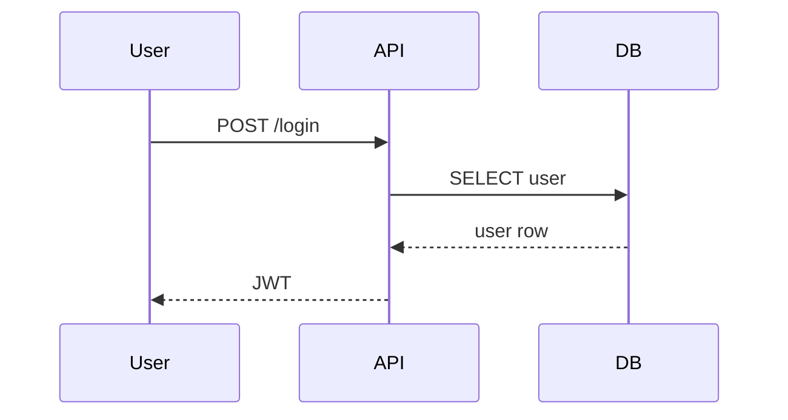

# Mermaid Diagrams

Use Mermaid for architecture, sequence, and flow diagrams. Fenced ` ```mermaid ` blocks in Markdown, or standalone `.mmd` files.

## Example

````markdown

````

## Rules

- Always validate syntax mentally before committing — broken Mermaid blocks render as raw text.
- Prefer small focused diagrams over one mega-diagram.
- For long-lived diagrams, store as `.mmd` and embed via include where the docs system supports it.
- Add or update diagrams when architecture, data flow, or sequence changes.
