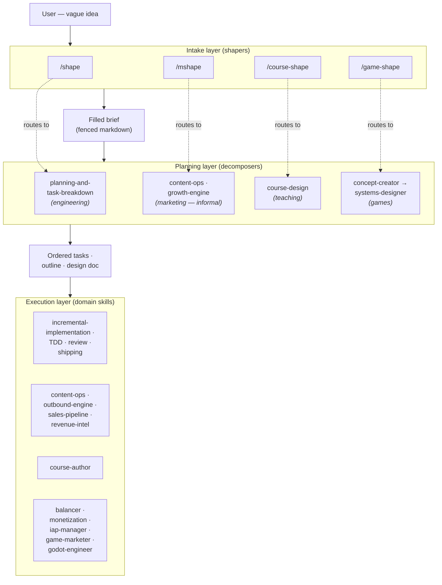
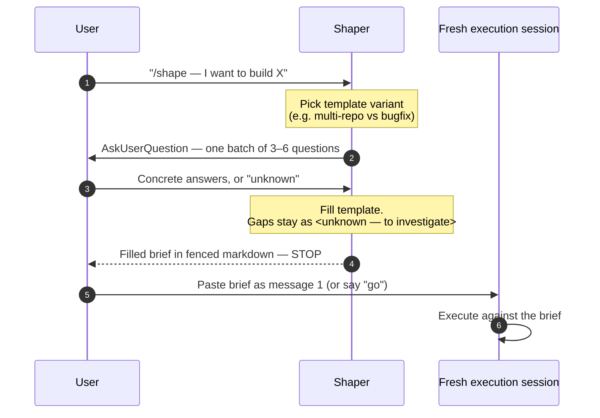
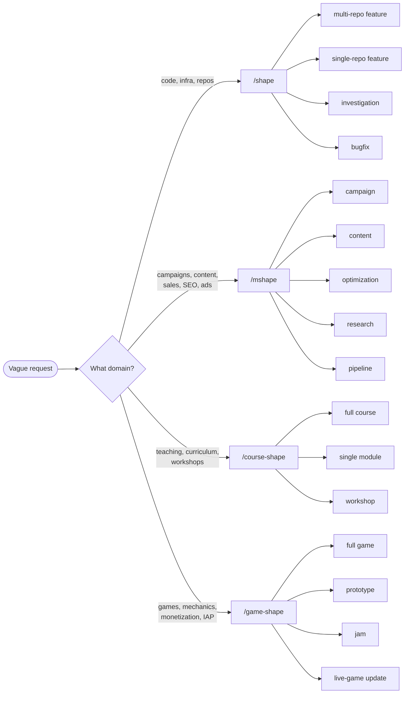

# Shapers

A **shaper** is an intake skill. It sits between a half-formed user request and the skills that actually do the work, and its only job is to convert vague intent into a structured brief that downstream skills can execute against without ambiguity.

A shaper does **not** generate code, content, curricula, or designs. It does not pick which skills run next. It does not start the work. It interviews, fills a template, prints the brief, and stops.

If that sounds narrow, that is the point. Most bad agent runs trace back to the first turn — an under-specified prompt that the agent then "interprets" with confident guesses. The shaper forces the unknowns into the open before any cost is sunk into the wrong direction.

## The four shapers

| Slash command     | Skill                | Domain               | Brief variants                                             |
| ----------------- | -------------------- | -------------------- | ---------------------------------------------------------- |
| `/shape`          | `prompt-shaper`      | Engineering          | multi-repo feature · single-repo · investigation · bugfix  |
| `/mshape`         | `marketing-shaper`   | Marketing & sales    | campaign · content · optimization · research · pipeline    |
| `/course-shape`   | `course-shaper`      | Teaching             | full course · single module · workshop                     |
| `/game-shape`     | `game-design-shaper` | Game design          | full game · prototype · jam · live-game update             |

Each shaper owns one domain. They are siblings, not a hierarchy — the right one is whichever domain the user's request lives in. When in doubt, the shapers cross-reference each other in their frontmatter so the loader routes correctly.

## How shapers fit into the system

Shapers are the intake layer. Below them is a planning layer that decomposes the brief into ordered, executable units. Below that is the execution layer of domain skills that actually do the work. The brief is the contract between intake and planning; the task list (or outline, or design doc) is the contract between planning and execution.

Three layers, two contracts. The dashed lines are tendencies, not guarantees — briefs and plans both describe *concerns*, not skill filenames, so any layer is free to load whichever skills match.

## The intake lifecycle

A single shaper run is a tight, four-beat sequence. It always ends at the brief.

Two structural choices worth calling out:

- **One batched round of questions, never a drip-feed.** Iterating one question at a time turns intake into an interrogation. The shaper instead picks the 3–6 highest-leverage unknowns and asks them all at once.
- **Stop after the brief.** The shaper does not transition into execution on its own. The user must say `go`, or — preferably — paste the brief into a fresh session.

## Picking the right shaper and template

Routing is two questions: *which domain*, then *which template within that domain*.

If the domain is genuinely ambiguous — e.g. "build a game-design course about cold email" — pick the shaper that matches the *deliverable* the user actually wants, not the topic. A course about cold email is still a course, so `/course-shape`.

## How to use a shaper

1. **Invoke with the slash command** (`/shape`, `/mshape`, `/course-shape`, `/game-shape`) and one or two sentences of intent. The shaper picks the template variant; if it cannot, it asks.
2. **Answer the batched question round concretely.** "Don't know yet" is a valid, useful answer — the brief will mark that section `<unknown — to investigate>`. Guessing is worse than admitting unknown.
3. **Read the brief.** It comes back as a single fenced markdown block. Treat it like a PR description: edit it before acting on it. Five seconds of edits now beats a wrong implementation later.
4. **Move to a fresh session for execution.** Open a new conversation, paste the brief as message 1, and let the execution skills load against the brief instead of the shaping conversation. The shaping conversation accumulates context that will confuse the executor.
5. **Or say `go`** to execute in the same session. Faster, but the shaper's clarifying turns will sit in context and may bias execution.

### Worked examples

Every shaper × template combination has a transcript-style example in [`examples/`](examples/) showing the messy initial request, the batched question round, the answers, and the final brief. Read those before authoring a brief by hand — the *shape* of a good brief is hard to describe and easy to recognize.

## After the brief: planning

A brief says *what* to do and *why*. It does not say *in what order* or *in what slices*. That is the planning layer's job. Each shaper has a corresponding planner whose input is the brief and whose output is something the execution layer can iterate on.

| Shaper          | Planner (consumes the brief)                       | Output                                   |
| --------------- | -------------------------------------------------- | ---------------------------------------- |
| `/shape`        | `planning-and-task-breakdown`                      | Ordered, verifiable tasks                |
| `/mshape`       | `content-ops` / `growth-engine` (informal — the brief usually decomposes naturally per channel) | Per-channel deliverables and experiments |
| `/course-shape` | `course-design`                                    | Modules → lessons → learning objectives  |
| `/game-shape`   | `game-concept-creator` → `game-systems-designer`   | Concept one-pager, design doc, system specs |

**Skip planning when** the brief is already small enough to execute as a single slice — a one-repo bugfix, a single content piece, a workshop with three obvious sections. Planning a trivial brief is the same overhead trap as shaping a trivial task.

**Use planning when** the brief is multi-repo, multi-module, multi-week, or multi-deliverable. Anything that cannot be held in one focused execution session belongs in a plan first.

The planning layer also has its own form of unknowns: dependencies between tasks, parallelism opportunities, hidden prerequisites. A good plan surfaces those the same way a good brief surfaces unknown audiences or success metrics.

## When **not** to use a shaper

- The request is one file, one obvious change, one sentence of done criteria. Shaping a trivial task is overhead.
- The brief already exists. If the user pastes a structured brief from a previous session, go straight to execution.
- The work is exploratory chat, not a deliverable. "What do you think about X?" is not a shaping prompt.
- The user explicitly says "just do it." Respect that — the shaper's value is in slowing down, and the user has opted out.

## Limitations

The shaper pattern is opinionated and has real edges. Knowing them prevents misuse.

**Single round of questions.** The shaper asks 3–6 questions once, then fills remaining gaps with `<unknown>`. If the brief feels thin, the answer is *not* a second round of questions inside the shaper — it is to edit the brief by hand or re-run the shaper with more upfront detail. This keeps intake from sliding into design-by-interview.

**No skill assignment.** Shapers describe *concerns* ("schema design", "store page conversion", "assessment design") and never name skill filenames. Naming a skill in the brief actively suppresses better matches when the loader routes the brief downstream. This is a deliberate constraint, but it means a brief cannot say "use skill X for step 3" — that decision belongs to the executor.

**Domain-bounded.** Each shaper has a fixed menu of template variants. A request that does not fit any variant — e.g. a hardware design, a legal memo, a personal-life decision — cannot be shaped by these four. The shaper will either pick the closest variant (badly) or punt. Add a new shaper rather than stretching an existing one.

**Garbage-in, garbage-out.** The brief is only as good as the user's answers. The shaper will not fact-check claims about audiences, metrics, retention floors, target stack, deadlines, or constraints. If the user says "our D7 retention floor is 25%" and that is a guess, the brief carries the guess into execution unmarked.

**Context bleed when shaping and executing in the same session.** The shaper's clarifying questions, the user's answers, and the shaper's reasoning all sit in conversation context. When the same session executes, that context can bias the work in subtle ways — re-asking already-answered questions, over-anchoring on early framing, repeating the user's words back as if they were specs. The recommended fix is a fresh session for execution; `go` in the same session is a convenience, not the default.

**Not a substitute for thinking.** A shaper surfaces unknowns. It does not resolve them. If a user does not know their audience, success metric, or target outcome, the brief will say so honestly — but the user still has to go answer those questions before serious work begins. The shaper is a forcing function, not an oracle.

**No iteration protocol inside the shaper.** There is no "shape v2" loop. If the brief is wrong, the user edits it by hand or re-invokes the shaper from scratch. This is intentional — iteration is execution's job, not intake's — but it means the shaper cannot evolve a brief based on partial execution feedback.

**Shaper-to-planner routing is wired but not enforced.** Each shaper's output line points multi-slice briefs at its planner ("run task breakdown next" for `/shape`, "decompose by channel" for `/mshape`, "hand it to course-design" for `/course-shape`, "hand it to concept-creator / systems-designer" for `/game-shape`). The user still has to follow the pointer — either paste the brief into a fresh session where the planner's triggers fire, or say `go` and let the shaper hand off. Single-slice briefs (investigations, scoped bugfixes, single content pieces) skip planning by design. The routing is a tendency, not a guarantee — a determined user can still execute a multi-slice brief without decomposition, and the result is usually a tangled implementation.

**No cross-shaper handoff.** A game course is shaped by `/course-shape`, not by chaining `/game-shape` into `/course-shape`. Each shaper owns one domain; they do not compose. Multi-domain work needs multiple briefs and a coordinating execution session.

**Multi-repo briefs need an approval gate downstream.** Cross-repo work is the most expensive to undo. The shaper produces an integrated plan, but the executor should pause for explicit user approval before touching multiple repos. The shaper itself cannot enforce this — it is a downstream rule.

## Anti-patterns

- **Asking the shaper to "just guess the rest."** Defeats the purpose. The whole point is to surface what the user has not thought through.
- **Naming skills inside the brief.** Suppresses better matches. Describe the concern instead.
- **Shaping a trivial task.** If the request is one file and one sentence of done criteria, skip the shaper.
- **Treating the brief as immutable.** It is a draft. Edit it before executing.
- **Running the shaper twice on the same conversation.** If the brief is wrong, fix it by hand. If it is unsalvageable, start over in a fresh session.

## TL;DR

A shaper turns "I want to build X" into a brief that downstream skills can act on. Pick the right shaper by domain, answer one batched round of questions, copy the brief into a fresh session, and execute there. Skip the shaper when the work is already obvious. Trust the brief about as far as you trust the answers that produced it.
